# Build guide

## parts list

| No | 品名                            | 個数 | 備考 |
|----|---------------------------------|------|------|
| 1  | 基板                            | 1    |
| 2  | GROVE コネクタ                  | 1    |
| 3  | ダイオード                      | 12   |
| 4  | ジョイスティック                | 1    |
| 5  | ピンソケット (1x8)              | 1    |
| 6  | ピンソケット (1x7)              | 1    |
| 7  | OLED 液晶                       | 1    |
| 8  | プルアップ抵抗                  | 1    |
| 9  | I型ピンソケット 2x6             | 2    |
| 10 | キースイッチ                    | 12   |
| 11 | キーキャップ                    | 12   |
| 12 | ソケット                        | 1    |
| 13 | RP2040 Zero                     | 1    |
| 14 | ロータリーエンコーダー          | 1    |
| 15 | SK6812MINI-E                    | 12   | 実装済み
| 16 | コム足                          | 1    |
| 17 | USB ケーブル (A to C)           | 1    |
| 18 | さらねじ 2.1x10                 | 6    |
| 19 | ケース                          | 1    |
| 20 | ロータリーエンコーダーノブ      | 1    |
| 21 | ロータリーエンコーダーノブ (大) | 1    |
| 22 | ジョイスティックノブ            | 1    |

## 作業台の組み立て

はんだ付けをスムーズに行うために作業台を組み立てます。  

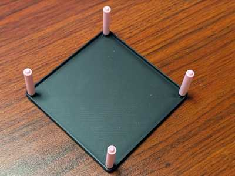

ケースのボトム側に `はんだサポート` をねじ止めして下さい。  
以降の作業はできるだけ作業台の上で実施してください。  

## マイコンのピン

ボードにピンソケット (1x8 x 2 + 1x7 x 1) を置く。  

RP2040 Zero 付属のピンヘッダーを刺してください。  
これにより、垂直を出すことができます。  

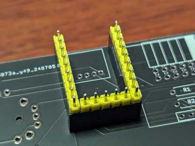

RP2040 Zero を置いてはんだ付けする。  
しっかり遠くまで刺さっていることを確認すること。  

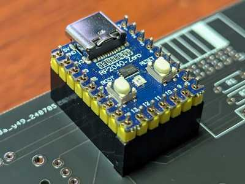

終わったら外しておいてください。  

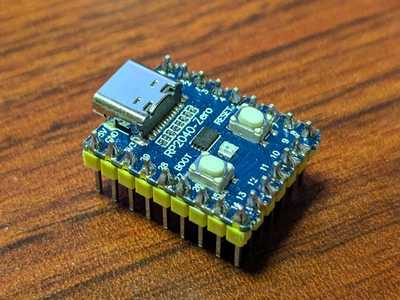

## RGB LED (SK6812MINI-E)

(実装済みのため省略)  

## ダイオード x 12

`ダイオード折り曲げ` に沿わせてピンを曲げる。  

ダイオード x 12 を向きに注意しつつ差し込む。  

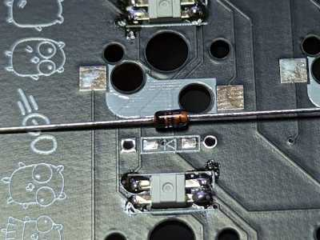
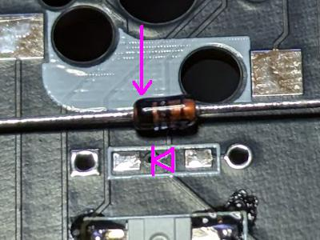

片側をはんだ付けする。  
位置が大きくずれたら再度熱してはんだを溶かし、位置を整える。  

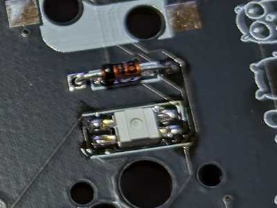

両側はんだ付け出来たら完成。  

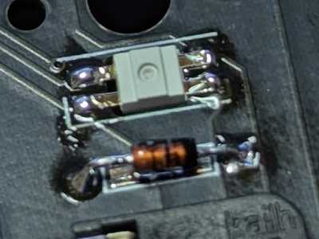

## スイッチソケット

シルクに合わせてソケットを置く。  

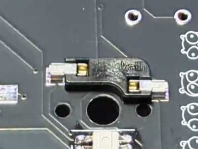

最初に片側はんだ付けする。  
しっかりとランド (基板側) を温めてからはんだを溶かす。  
はんだが解けたら、籠手を着けたまま指でソケットを下に押し込む。  
しっかりと刺さり切った位置ではんだ付けを完了させる必要あり。  

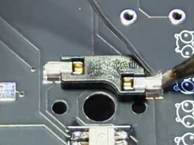
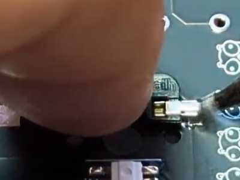

続いて反対側をはんだ付けする。  

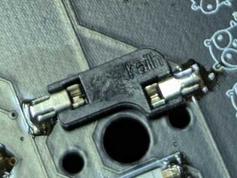

## ジョイスティック

ここから表面での作業になります。  

ジョイスティックを置いたら矢印の箇所をはんだ付けする。  
はんだ付け出来たらしっかり刺さっているのか確認し、刺さってない場合ははんだを溶かして位置を整える。  

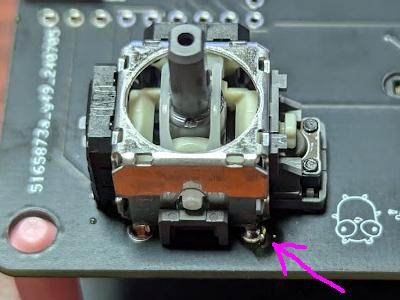

もう一か所はんだ付けする。  

裏返してすべての箇所をはんだ付けする。  
矢印の 4 箇所ははんだ付けを省略しても良い (はんだ付けしても良い。  

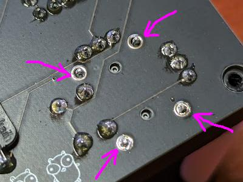

## Grove コネクター

矢印のピンだけはんだ付けする。  
はんだ付け出来たら位置と向きを確認し、必要があればはんだを溶かして整える。  

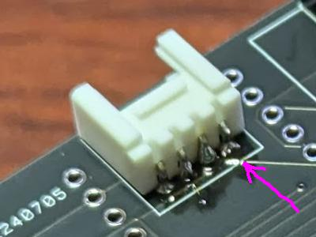

次に矢印のピンを止めて 2 ピン止まっている状態にする。  
はんだ付けできたら位置／向き確認し、必要があればはんだを溶かして整える。  

残りのピンをはんだ付けする。  

## L 字 2x6 ピンソケット

Grove コネクターと同じで 1 ピンだけはんだ付けする。  
はんだ付けできたら位置／向き確認し、必要があればはんだを溶かして整える。  

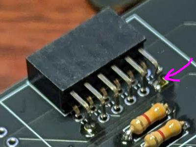

次に矢印のピンを止めて 2 ピン止まっている状態にする。  
はんだ付けできたら位置／向き確認し、必要があればはんだを溶かして整える。  

残りのピンを裏側からはんだ付けする。  

## 抵抗 x 2

ダイオードと同じように (ただし、向きはどちらでもよい) 片側をはんだ付けする。  
位置が大きくずれたら再度熱してはんだを溶かし、位置を整える。  

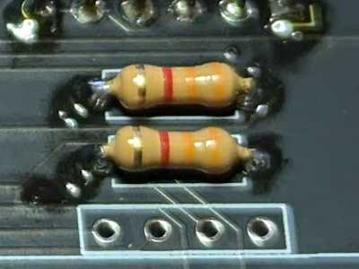

両側はんだ付けできたら完成。  

## ロータリーエンコーダー

まずは基板に差し込んでください。  
その際、作業台から外して差し込んだ方が簡単です。  
差し込む向きに注意 (ジョイスティックと同じ側に回転部がくる) してください。  
裏から見て、ちゃんと刺さっていることを確認すること。  

Grove コネクターと同じで 1 ピンだけはんだ付けする。  
はんだ付けできたら位置／向き確認し、必要があればはんだを溶かして整える。  

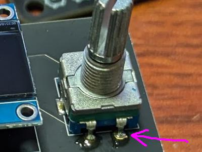

2 ピン目をはんだ付けする。  
はんだ付けできたら位置／向き確認し、必要があればはんだを溶かして整える。  

残りのピンをはんだ付けする。  

## マイコンのソケット

ソケット (1x8 x 2 + 1x7 x 1) を刺して、マイコンも置く (これにより垂直を出す)。  
必要に応じてマスキングテープ等で止める。  
誰かに手伝ってもらうのも手。  

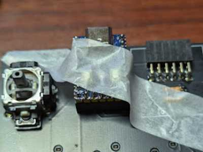

裏面から ① → ② → ③ の順ではんだ付けする。  
1 ピン毎にちゃんと刺さっているかを確認し、必要に応じてはんだを溶かして位置を整える。  

残りのピンをはんだ付けする。  

## 液晶

基板に液晶を軽く差し込む (奥まで刺さず、ほんの少しだけ差し込む)。  

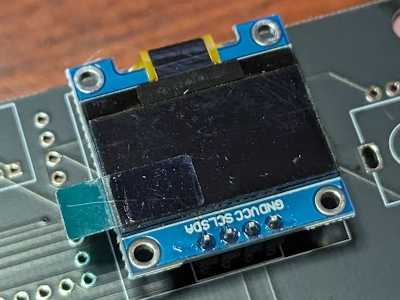

作業台からおろして、保護フィルムを剥がす。  
写真では保護フィルムをはがしていないですが、この時点ではがしてください。  
ケースを付ける。  
明らかに液晶の位置が悪ければ調整する。  
ケースはしっかり基板にはまるまで押し込む事 (作業台のままではこの作業が出来ない)。  

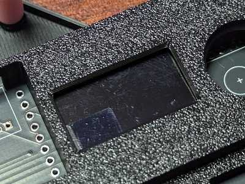

裏返してはんだ付けする。  
ここでも 1 ピンだけ付けてひっくり返して確認、というのを繰り返す。  
1 ピン毎にちゃんと刺さっているかを確認し、必要に応じてはんだを溶かして位置を整える。  

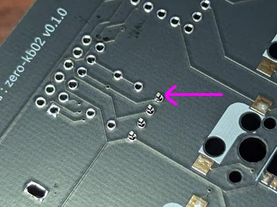

4 ピンすべてはんだ付け出来たら完成。  
